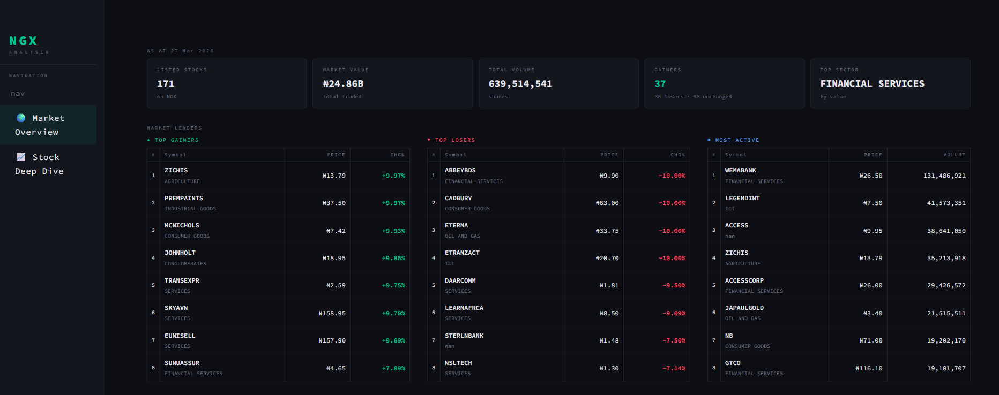
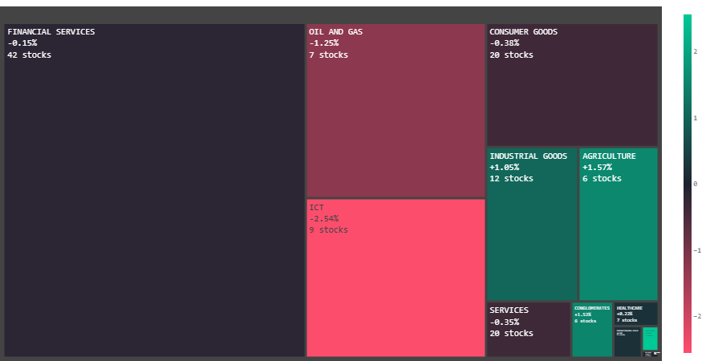
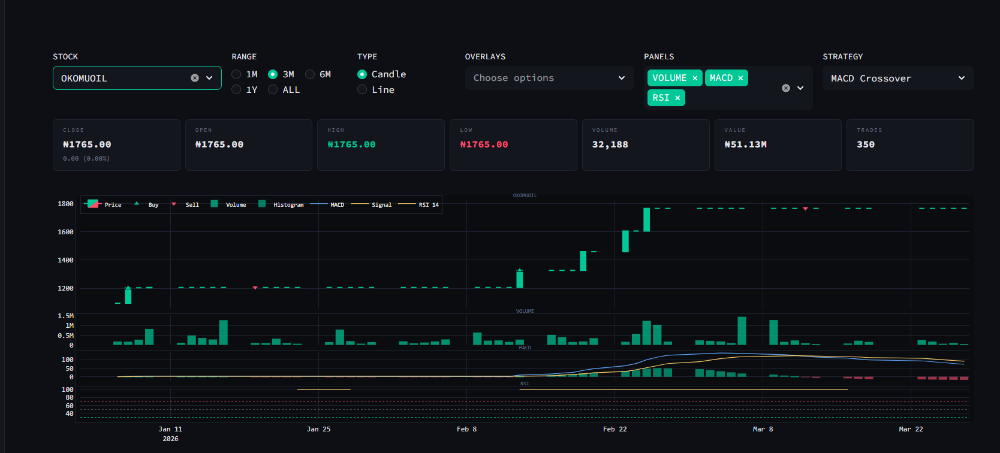
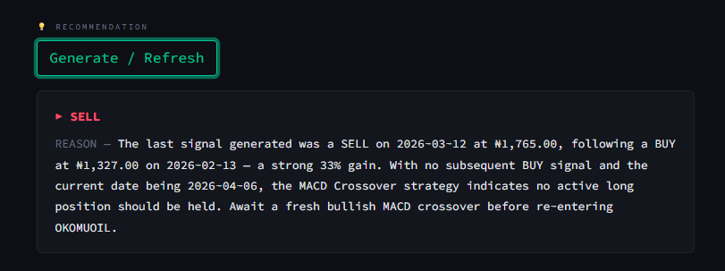

# NGX Analyser


A Streamlit-based technical analysis dashboard for equities listed on the **Nigerian Exchange (NGX)**. Data is served from a local SQLite database. Indicators are computed in pure pandas at query time; trading signals are generated by rule-based crossover strategies; AI recommendations are produced by Claude (`claude-sonnet-4-6`) via a LangChain chain.

---

## Screenshots

### Market Overview



### Sector Overview



### Stock Deep Dive



### AI Recommendation



---

## Architecture

```
app.py  (st.set_page_config + sidebar router)
  │
  ├── views/market_overview.py   ──► charts/market_overview.py  (Plotly figs)
  │         └── data/loader.py   ──► utility/db.py  (sqlite3)
  │
  └── views/deep_dive.py         ──► charts/deep_dive.py        (Plotly figs)
            ├── data/loader.py
            ├── data/indicators.py      (pure pandas)
            ├── analysis/signals.py     (crossover strategies)
            └── analysis/recommender.py (LangChain + Claude)
```

**Layer rules:**

- `views/` — Streamlit rendering only; no chart construction, no raw SQL
- `charts/` — accept DataFrames, return `go.Figure`; no `st.*` calls
- `data/loader.py` — all queries; every function wrapped in `@st.cache_data`
- `data/indicators.py` — stateless functions only; no I/O
- `analysis/signals.py` — every strategy returns `(buy_df, sell_df)` and is registered in the `STRATEGIES` dict for UI dispatch
- `config.py` — single source of truth for colours (`ACCENT`, `RED`, etc.) and `PLOTLY_BASE` layout defaults; `charts/deep_dive.py` applies these explicitly via `update_layout()` rather than dict-unpacking to avoid duplicate-kwarg errors on multi-panel subplots

---

## Technical Indicators

All computed in `data/indicators.py` against `ClosePrice`:

| Indicator | Function | Parameters |
| --- | --- | --- |
| SMA | `calculate_sma(series, window)` | 50, 200 |
| EMA | `calculate_ema(series, window)` | 12, 26 |
| RSI | `calculate_rsi(series, window)` | 14, 7 |
| MACD | `calculate_macd(series, short, long, signal)` | 12, 26, 9 |

`add_all_indicators(df)` appends all of the above as new columns to a copy of the OHLCV DataFrame.

---

## Trading Strategies

Defined in `analysis/signals.py`. Each function returns `(buy_df, sell_df)` — filtered rows of the price DataFrame where the signal fired.

| Strategy | Buy condition | Sell condition |
| --- | --- | --- |
| `macd_signals` | MACD crosses above Signal line | MACD crosses below Signal line |
| `rsi_signals` | RSI crosses up through oversold (30) | RSI crosses down through overbought (70) |
| `sma_crossover_signals` | SMA 50 crosses above SMA 200 (golden cross) | SMA 50 crosses below SMA 200 (death cross) |

---

## Database

SQLite file at `utility/ngx.sqlite` (~26 MB). Two tables are used:

### `Trades`

135,305 rows · date range: 2021-12-31 → 2026-03-27

| Column | Type | Notes |
| --- | --- | --- |
| `TradeDate` | TEXT | ISO datetime string, parsed with `format="mixed"` |
| `Symbol` | TEXT | NGX ticker |
| `PrevClosingPrice` | FLOAT | |
| `OpeningPrice` | FLOAT | |
| `HighPrice` | FLOAT | |
| `LowPrice` | FLOAT | |
| `ClosePrice` | FLOAT | Used for all indicator calculations |
| `Change` | FLOAT | Absolute day change |
| `Volume` | FLOAT | |
| `Value` | FLOAT | NGN value traded |
| `Trades` | FLOAT | Number of trades |

### `IndustryData`

148 rows — Symbol → Sector mapping, left-joined onto market queries.

| Column | Type |
| --- | --- |
| `Symbol` | TEXT |
| `Sector` | TEXT |

---

## AI Recommendations

`analysis/recommender.py` builds a LangChain chain:

```python
chain = PromptTemplate(...) | ChatAnthropic(model="claude-sonnet-4-6") | StrOutputParser()
```

The prompt passes `buy_signal`, `sell_signal`, `stock_details`, and today's date. Claude returns a `Recommendation: BUY / SELL` verdict followed by a `Reason:` paragraph (max 80 words). The result is cached in `st.session_state[f"reco_{symbol}"]` until the user clicks **Generate / Refresh** again.

---

## Tech Stack

| Layer | Library |
| --- | --- |
| UI | `streamlit >= 1.35` |
| Charts | `plotly >= 5.22` |
| Data | `pandas >= 2.0`, `sqlite3` (stdlib) |
| Indicators | Pure pandas — no TA-Lib |
| AI | `langchain-anthropic >= 1.4`, `langchain-core >= 0.2` |
| Config | `python-dotenv >= 1.0` |

---

## Setup

### 1. Clone and create a virtual environment

```bash
git clone <repo-url>
cd G_Stock
python -m venv gstock
source gstock/Scripts/activate      # Windows bash
# or: gstock\Scripts\activate.bat
```

### 2. Install dependencies

```bash
pip install -r G_stock/requirements.txt
```

### 3. Configure environment

Create `G_stock/.env`:

```env
DB_PATH=utility/ngx.sqlite
ANTHROPIC_API_KEY=your_key_here
```

### 4. Run

```bash
cd G_stock
streamlit run app.py
# → http://localhost:8501
```
